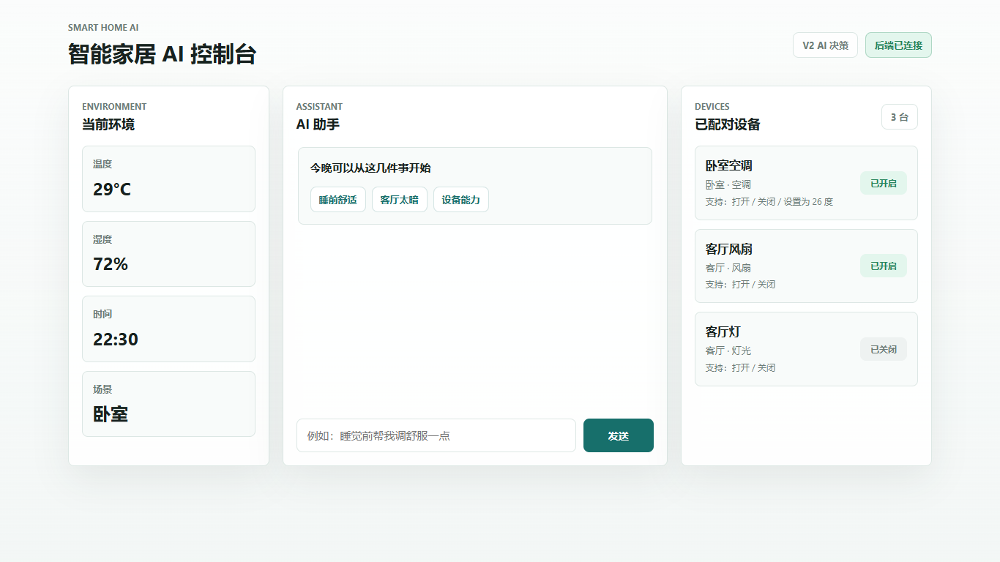

# Smart Home AI

基于大模型决策的智能家居助手 Demo。用户可以通过自然语言描述需求，系统结合当前环境、设备状态和设备能力生成控制建议，并在用户确认后执行虚拟设备动作。



当前项目已完成：

- **V1**：文字版软件闭环，规则模拟 AI，虚拟设备控制。
- **V2**：接入 OpenAI-compatible 大模型接口，升级为 AI 家居决策助手。
- **V2.1**：重设计前端页面，升级为智能家居 AI 控制台。

## 项目定位

Smart Home AI 面向老旧家电的低成本智能化改造场景。当前阶段不直接控制真实硬件，而是先验证完整软件链路：

```text
用户输入自然语言
→ 后端读取环境信息和设备状态
→ AI 生成安全的控制建议
→ 前端展示建议动作
→ 用户确认执行
→ 虚拟设备状态更新
→ 前端刷新展示结果
```

## 核心能力

- 自然语言理解：支持“好热”“客厅太暗了”“睡觉前帮我调舒服一点”等表达。
- 环境感知：读取当前温度、湿度、时间、场景。
- 设备状态理解：知道设备是否已开启，以及支持哪些动作。
- 安全执行：AI 只生成建议，设备动作必须由用户确认后执行。
- 动作校验：后端校验大模型输出，避免执行不存在设备或不支持动作。
- 本地兜底：未启用大模型时，仍可使用 V1 规则模式演示。

## 技术栈

| 模块 | 技术 |
|---|---|
| 前端 | HTML + CSS + JavaScript |
| 后端 | Node.js + Express |
| AI | OpenAI-compatible Chat Completions API |
| 配置 | dotenv |
| 设备 | 内存中的虚拟设备 |

## 快速开始

### 1. 安装依赖

```bash
npm install
```

### 2. 配置大模型

复制配置模板：

```bash
cp .env.example .env
```

Windows PowerShell 可以使用：

```powershell
Copy-Item .env.example .env
```

编辑 `.env`：

```env
LLM_ENABLED=true
LLM_API_KEY=your_api_key
LLM_BASE_URL=https://your-openai-compatible-base-url/v1
LLM_MODEL=your-model-name
LLM_TIMEOUT_MS=15000
```

如果暂时没有大模型 Key，可以保持：

```env
LLM_ENABLED=false
```

此时系统会使用 V1 规则模式，仍然可以完成基础演示。

> `.env` 已被 `.gitignore` 忽略，不要提交真实 API Key。

### 3. 启动后端

```bash
npm start
```

后端服务地址：

```text
http://localhost:5000
```

### 4. 打开前端

直接在浏览器中打开：

```text
frontend/index.html
```

推荐测试输入：

```text
睡觉前帮我调舒服一点
客厅太暗了
你能控制什么
```

## API 接口

| 方法 | 路径 | 说明 |
|---|---|---|
| GET | `/api/state` | 获取当前环境信息和设备列表 |
| POST | `/api/chat` | 提交自然语言输入，获取 AI 建议 |
| POST | `/api/execute` | 用户确认后执行设备动作 |

### POST /api/chat 响应示例

```json
{
  "reply": "当前卧室温度29度，睡前会偏热。我建议把卧室空调设置为25度，需要我帮你设置吗？",
  "intent": "comfort_sleep",
  "needConfirm": true,
  "action": {
    "deviceId": "bedroom_ac",
    "command": "set_temperature",
    "value": 25
  }
}
```

### POST /api/execute 请求示例

```json
{
  "deviceId": "bedroom_ac",
  "command": "set_temperature",
  "value": 25
}
```

## 当前虚拟设备

| 设备 ID | 名称 | 位置 | 支持动作 |
|---|---|---|---|
| `bedroom_ac` | 卧室空调 | 卧室 | `turn_on`, `turn_off`, `set_temperature` |
| `livingroom_fan` | 客厅风扇 | 客厅 | `turn_on`, `turn_off` |
| `livingroom_light` | 客厅灯 | 客厅 | `turn_on`, `turn_off` |

## 项目结构

```text
smart-home-ai/
├── backend/
│   ├── server.js              # Express 服务和 API 路由
│   ├── devices.js             # 虚拟设备和环境状态
│   ├── aiAgent.js             # AI 决策入口
│   ├── llmClient.js           # OpenAI-compatible 大模型客户端
│   ├── decisionValidator.js   # 大模型决策校验
│   ├── ruleAgent.js           # V1 规则模式
│   └── executor.js            # 虚拟设备动作执行
├── frontend/
│   ├── index.html             # 控制台页面结构
│   ├── style.css              # 控制台样式
│   └── app.js                 # 前端交互逻辑
├── docs/
│   ├── API.md
│   ├── TEAM_DEVELOPMENT_GUIDE.md
│   ├── V1_ACCEPTANCE.md
│   └── V2_DEVELOPMENT_PLAN.md
├── .env.example
├── package.json
└── README.md
```

## 大模型决策策略

V2 的大模型不是只做意图分类，而是作为家居决策助手：

1. 理解用户自然语言。
2. 结合环境信息和设备状态。
3. 生成自然语言解释。
4. 输出一个可选的建议动作。
5. 后端校验动作是否合法。
6. 前端等待用户确认后再执行。

如果 `LLM_ENABLED=true` 但模型调用失败、超时、返回非 JSON 或返回非法动作，系统会返回安全的无动作提示，不会直接执行任何设备控制。

## 验收场景

| 输入 | 预期 |
|---|---|
| `睡觉前帮我调舒服一点` | 建议卧室空调设置为 26 度 |
| `客厅太暗了` | 建议打开客厅灯 |
| `你能控制什么` | 返回设备能力说明，不需要确认 |
| `打开不存在的设备` | 不生成非法动作 |
| 后端未启动 | 前端显示连接异常，不弹出浏览器 alert |

## 版本记录

| 版本 | 内容 |
|---|---|
| V1 | 文字版 Demo，规则模拟 AI，虚拟设备，完成软件闭环 |
| V2 | 接入 OpenAI-compatible 大模型，增加决策校验和安全无动作返回 |
| V2.1 | 重设计前端控制台，增加连接状态、快捷入口、对话气泡和响应式布局 |

后续规划：

- **V3**：设备配对与红外学习。
- **V4**：语音交互。
- **V5**：真实硬件控制，接入 ESP32 + 红外模块。
- **V6**：主动智能提醒。

## 文档

- [API 文档](docs/API.md)
- [团队开发规范](docs/TEAM_DEVELOPMENT_GUIDE.md)
- [V1 验收记录](docs/V1_ACCEPTANCE.md)
- [V2 开发说明](docs/V2_DEVELOPMENT_PLAN.md)

## 许可证

MIT
