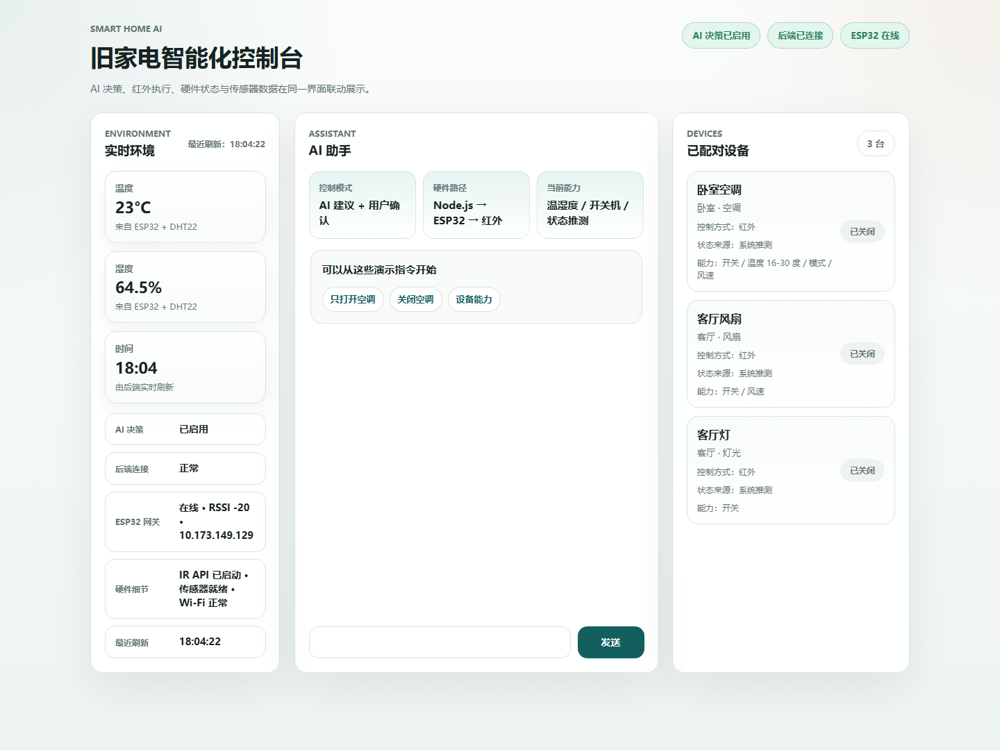

# Smart Home AI

用 AI + 红外控制改造旧家电，让传统红外家电获得自然语言控制能力。



当前项目已经进入 `V3 硬件接入阶段`，主链路已经从“软件模拟执行”升级为“后端调用 ESP32，ESP32 发射真实红外码，旧家电真实响应”。

## 项目定位

大量家庭仍在使用传统红外家电，比如旧空调、旧风扇、旧电视。这些设备功能正常，但无法联网，也无法直接接入现代智能家居平台。

Smart Home AI 的目标不是让用户整套更换设备，而是通过：

- AI 决策
- 红外控制
- 设备能力建模
- 推测状态管理

让旧家电也能被理解、建议和控制。

## 当前版本

当前主线进度如下：

- `V1`：文字版软件闭环，规则模拟 AI，虚拟设备控制
- `V2`：接入大模型决策、后端校验、用户确认执行
- `V2.1`：前端控制台重设计
- `V2.2`：红外设备能力模型升级
- `V3`：ESP32 硬件接入，真实红外执行、实时温湿度、OLED 本地状态面板

## V3 已完成能力

当前已经跑通的能力：

- ESP32 通过公网 WSS/443 主动连接 Node.js 后端，USB 串口保留为调试兜底
- ESP32 发射真实红外码控制旧家电
- DHT22 温湿度实时读取
- 控制台实时展示温度、湿度、时间、系统状态
- OLED 本地显示：
  - `WiFi`
  - `IR API`
  - `温湿度`
  - `AC 状态`
- 后端记录：
  - `assumedState`
  - `lastCommand`
  - `stateConfidence`

## 当前硬件

- `ESP32-S3` 开发板：`YD-ESP32-S3`
- `DHT22 / AM2302` 温湿度模块
- 红外接收模块
- 红外发射模块
- `0.91"` OLED 显示屏，I2C，`SSD1306`

## 当前接线

### DHT22

- `DAT -> GPIO6`
- `VCC -> 3V3`
- `GND -> GND`

### IR Receiver

- `OUT -> GPIO5`
- `VCC -> 3V3`
- `GND -> GND`

### IR Transmitter

- `DAT -> GPIO4`
- `VCC -> 5V`
- `GND -> GND`

### OLED

- `GND -> GND`
- `VCC -> 3V3`
- `SCL -> GPIO18`
- `SDA -> GPIO17`

## 已验证红外码

当前已验证成功的空调电源码：

- 协议：`COOLIX`
- 码值：`0xB21FB8`
- 位数：`24`

当前空调的 `turn_on` 和 `turn_off` 暂时共用同一条电源切换码，因此系统现在维护的是推测状态，而不是真实回传状态。

## 系统架构

```text
用户输入自然语言
-> 前端控制台
-> Node.js 后端
-> AI 决策 / 规则兜底
-> 后端校验动作
-> 用户确认执行
-> 后端通过串口/网络调用 ESP32
-> ESP32 发射红外码
-> 旧家电响应
-> 后端更新 assumedState / lastCommand / stateConfidence
```

## 当前控制台能力

控制台已使用 `Vue 3 + Vite + Pinia + Vue Router` 重构，当前支持：

- 实时温度
- 实时湿度
- 实时时间
- AI 决策启用状态
- 后端连接状态
- ESP32 在线状态
- ESP32 RSSI / IP / 硬件状态
- 已配对设备状态展示
- 快捷控制入口
- AI 对话与动作确认
- 设备定义管理
- 分温度红外码学习
- Demo / Hybrid / Hardware 运行模式
- 控制台电脑麦克风语音输入
- 浏览器 ASR、AI 决策与电脑扬声器语音回复
- 深色、浅色主题与移动端布局

## 设备模型

当前红外设备模型已经支持：

- `controlType=ir`
- `capabilities`
- `irProfile`
- `assumedState`
- `lastCommand`
- `stateConfidence`

这让系统可以明确区分：

- 真实传感器数据
- 后端已执行过的命令
- 基于红外控制推测出的设备状态

## 快速开始

### 1. 安装依赖

需要 Node.js 20 或更高版本。

```bash
npm install
```

### 2. 配置环境变量

复制模板：

```bash
cp .env.example .env
```

Windows PowerShell：

```powershell
Copy-Item .env.example .env
```

按需编辑 `.env`。模型相关变量只用于 SQLite 首次初始化，服务启动后推荐在控制中心的“模型配置”页面管理：

```env
APP_MODE=demo
DATABASE_PATH=./data/smart-home.db
LLM_ENABLED=true
LLM_API_KEY=your_api_key
LLM_BASE_URL=https://your-provider.example
LLM_ENDPOINT_PATH=/v1/chat/completions
LLM_MODEL=your-model-name
LLM_TIMEOUT_MS=15000

ESP32_ENABLED=true
ESP32_TRANSPORT=auto
ESP32_WS_PATH=/ws/esp32
ESP32_WS_TOKEN=generate-a-random-token-at-least-32-characters
SERIAL_PORT=COM3
SERIAL_BAUD_RATE=115200
```

首次启动后可以在“模型配置”中分别启用或停用语言模型、ASR 和 TTS；保存后立即生效，不需要重启。

如果首次初始化时暂时不启用大模型，可以设置：

```env
LLM_ENABLED=false
```

运行模式说明：

- `demo`：规则决策、模拟环境和模拟设备执行
- `hybrid`：LLM 决策，可选择模拟执行或 ESP32
- `hardware`：LLM 决策和 ESP32 真实红外控制

### 3. 构建并启动

```bash
npm run build
npm start
```

默认地址：

```text
http://localhost:5000
```

### 4. 前端开发模式

分别启动后端和 Vite：

```bash
npm run dev:backend
npm run dev:frontend
```

开发页面地址为 `http://localhost:5173`，生产页面由后端在 `http://localhost:5000` 提供。

### 5. Windows 一键启动

如果你想一键启动后端并自动打开前端，可以直接：

```text
双击 start-smart-home-ai.bat
```

或者在终端里执行：

```bash
npm run launch
```

这个脚本会：

- 构建 Vue 前端
- 只停止当前项目的旧后端进程
- 后台启动 Node.js 服务
- 等待后端就绪
- 自动打开 `http://localhost:5000`

## 数据持久化

设备定义、红外码、设备推测状态、执行事件，以及 LLM、ASR、TTS 模型配置统一保存在 SQLite：

```text
data/smart-home.db
```

首次升级时，后端会自动将现有 `data/devices.json` 和 `data/ir_codes.json` 导入数据库，并将 `.env` 中已有的模型配置写入 `model_configs` 表。导入只执行一次，后续以数据库配置为准。

数据库位置可通过 `DATABASE_PATH` 修改。运行数据和数据库文件已加入 `.gitignore`，仓库只保留 `data/*.example.json` 示例。

## 服务器部署

单家庭、单教室或单实例部署推荐继续使用 SQLite，并将 `data/` 挂载到持久化磁盘。仓库提供了 `Dockerfile` 和 `docker-compose.yml`：

```bash
docker compose up -d --build
```

Docker Desktop 下无法直接使用 Windows 的 `COM3`，Compose 默认使用 WebSocket。当前 ESP32 通过固定公网域名的 WSS/443 接入，容器端口保持绑定到 `127.0.0.1`，由公网网关转发 WebSocket 升级请求。

公网部署必须放在 HTTPS/WSS 反向代理之后并增加访问认证，不能直接暴露控制 API。详细方案见 [服务器部署建议](docs/DEPLOYMENT.md)。需要多用户或多实例时，再将数据层迁移到 PostgreSQL。

## ESP32 固件

固件位于：

- [firmware/esp32_ir_bridge/esp32_ir_bridge.ino](firmware/esp32_ir_bridge/esp32_ir_bridge.ino)

固件说明位于：

- [firmware/README.md](firmware/README.md)

当前固件通过 WebSocket 和 USB 串口共用的 JSON 协议提供：

- `health`：读取硬件与温湿度状态
- `ir_send`：发射指定协议的红外码
- `ir_learn`：捕获遥控器红外码
- 语音交互已迁移到控制台：电脑麦克风采集与电脑扬声器播放

ESP32 固件编译：

```bash
npm run firmware:compile
```

控制台麦克风、ASR 和电脑扬声器流程见 [控制台浏览器语音说明](docs/VOICE.md)。

当前推荐的连接方式是：

- ESP32 通过 Wi-Fi 主动连接后端的 `/ws/esp32`
- 后端优先使用 WebSocket，网络不可用时自动使用 USB 串口
- 每条网络命令通过 `requestId` 匹配响应

网络配置、令牌设置和烧录步骤见 [ESP32 网络连接说明](docs/ESP32_NETWORK.md)。

## API 概览

### `GET /api/state`

返回：

- `environment`
- `devices`
- `system`

其中 `environment` 当前包含：

- `temperature`
- `humidity`
- `time`
- `source`

### `POST /api/chat`

提交自然语言输入，返回：

- AI 回复
- 是否需要确认
- 建议执行动作

### `POST /api/execute`

用户确认后执行设备动作。

当前已经支持真实联动：

- `bedroom_ac / turn_on`
- `bedroom_ac / turn_off`

## 项目结构

```text
smart-home-ai/
├── backend/
│   ├── aiAgent.js
│   ├── database.js
│   ├── commandEventStore.js
│   ├── decisionValidator.js
│   ├── deviceStore.js
│   ├── devices.js
│   ├── esp32Client.js
│   ├── executor.js
│   ├── irCodeStore.js
│   ├── llmClient.js
│   ├── routes/
│   ├── services/
│   ├── ruleAgent.js
│   └── server.js
├── firmware/
│   ├── README.md
│   └── esp32_ir_bridge/
│       └── esp32_ir_bridge.ino
├── frontend/
│   ├── index.html
│   ├── src/
│   └── vite.config.js
├── data/
│   ├── devices.example.json
│   └── ir_codes.example.json
├── docs/
│   ├── API.md
│   ├── TEAM_DEVELOPMENT_GUIDE.md
│   ├── V1_ACCEPTANCE.md
│   ├── V2_DEVELOPMENT_PLAN.md
│   └── V3_HARDWARE_NOTES.md
├── .env.example
├── Dockerfile
├── docker-compose.yml
├── package.json
└── README.md
```

## 当前已知边界

这套方案已经适合 `V3 验证和展示`，但仍有两个客观限制：

### 1. 红外设备通常是单向控制

系统无法天然获知“用户是否用原遥控器改过状态”，所以当前状态主要是：

- 后端已执行命令
- 结合设备模型维护出的推测状态

### 2. 红外码录入仍需继续扩展

当前已经跑通：

- 空调开关机

后续建议继续补：

- `set_temperature`
- `mode`
- `fanSpeed`

## 下一步建议

最值得继续推进的方向：

1. 录入空调调温红外码，打通 `set_temperature`
2. 录入模式和风速控制
3. 做红外学习流程，减少手工录码成本
4. 进一步增强状态可信度模型

## 文档

- [API 文档](docs/API.md)
- [团队开发规范](docs/TEAM_DEVELOPMENT_GUIDE.md)
- [V3 硬件记录](docs/V3_HARDWARE_NOTES.md)

## License

MIT
